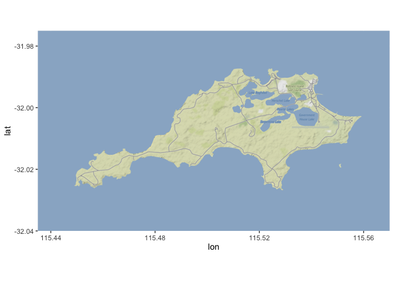
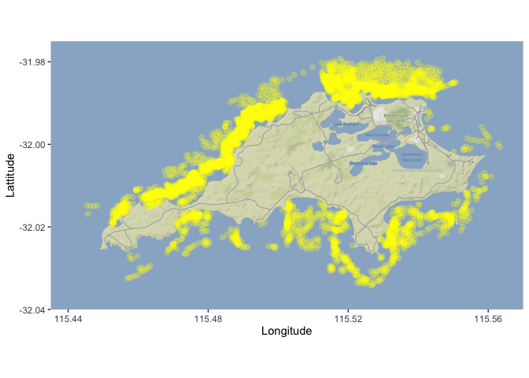
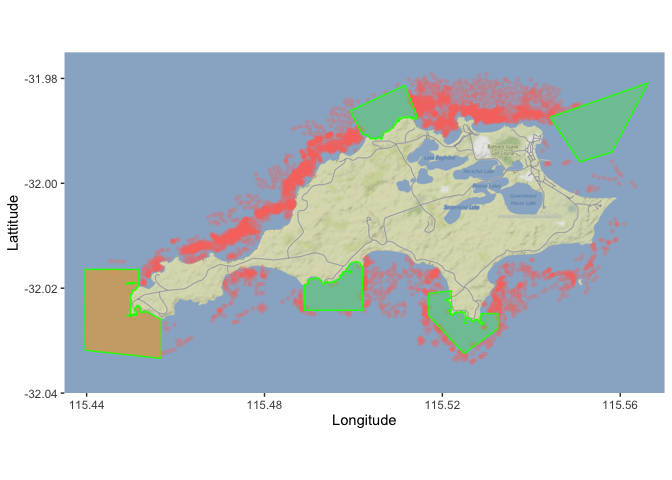
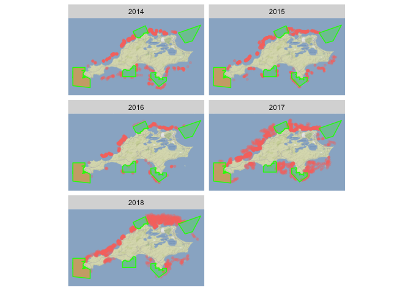
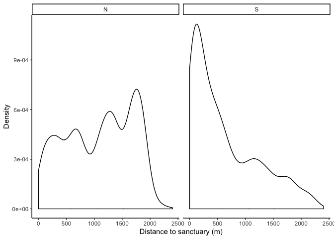
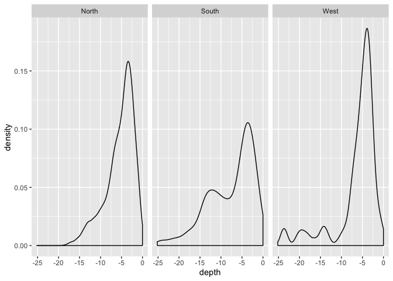
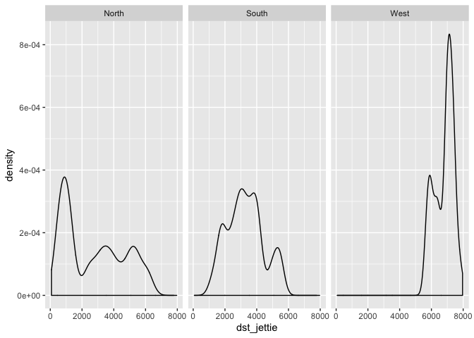
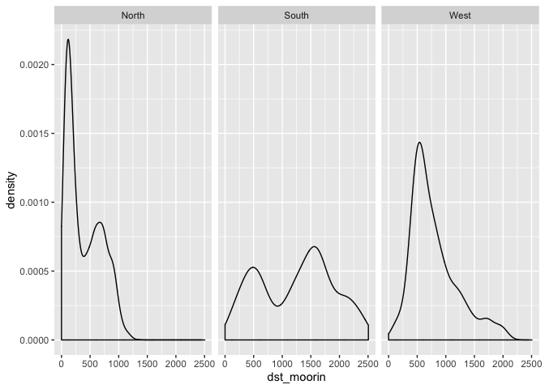
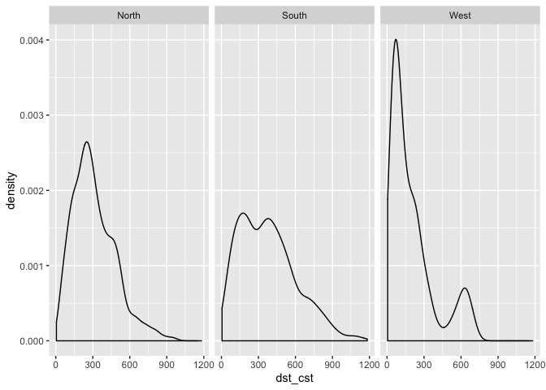

BIOL4408 Marine Ecology: lobster pots 1.
================
TimLanglois
09/01/2020

# 1\. Import lobster pot data

1.  Import data - Tim has done tricky stuff in another script
2.  Plot and describe the data.

Need to install a missing library

``` r
# install.packages("ggmap")
```

Next we load some librarys

``` r
library(tidyr) #to tidy data
library(dplyr) #to transform data
library(readr) #to write data
library(ggplot2) #to plot data
library(ggmap)
library(readr) #to write data
library(here) #to make robust links to files
```

It is useful to set a study name

``` r
study<-"lobster.pots"
```

We are going to use the here() function, which creates a shortcut to
your
    location.

``` r
here::here()
```

    ## [1] "/Users/00068010/GitHub/UWA-BIOL4408-Marine-Ecology/Analysis-lobster-pots"

As long as the names on the folders are consistent this function will
enable us to work across computers and operating systems.

If you are using an ecocloud server - we will have to add folder names
to the here() function - but this should work

\#here(“workspace”,“Template-lobster-pots”,“Data”)

Let’s make a shortcut to that “Data” directory.

``` r
data.dir <- here::here("Data")

#or for ecocloud

#data.dir <- here("workspace","Template-lobster-pots","Data")
```

Let’s make a plots directory and then shortcut to that directory.

``` r
dir.create(file.path(here::here(), "Plots")) #create Data folder

plot.dir <- here::here("Plots")

#or for ecocloud
#dir.create(file.path(here(), "workspace","Template-lobster-pots","Plots")) #create Data folder

#data.dir <- here("workspace","Template-lobster-pots","Plots")
```

Read in polygons of NTR——

``` r
setwd(data.dir)
dir()
```

    ##  [1] "2017_Group1.csv"              "2017_Group2.csv"             
    ##  [3] "2018_Group1.csv"              "2018_Group2.csv"             
    ##  [5] "dat.model.csv"                "group1.lob.pot1.all.null.csv"
    ##  [7] "group2.lob.pot1.all.null.csv" "lobster.distance.png"        
    ##  [9] "lobster.pots.2019-01-23.csv"  "ntr.2019-01-23.csv"

``` r
ntr<-read_csv("ntr.2019-01-23.csv")%>%
  glimpse()
```

    ## Parsed with column specification:
    ## cols(
    ##   X = col_double(),
    ##   Y = col_double(),
    ##   order = col_double(),
    ##   hole = col_logical(),
    ##   piece = col_double(),
    ##   id = col_double(),
    ##   group = col_double(),
    ##   lat = col_double(),
    ##   lon = col_double()
    ## )

    ## Observations: 2,974
    ## Variables: 9
    ## $ X     <dbl> 358933.0, 358933.0, 358933.1, 358933.0, 358933.0, 358932.8, 358…
    ## $ Y     <dbl> 6459647, 6459647, 6459647, 6459647, 6459647, 6459644, 6459642, …
    ## $ order <dbl> 1, 2, 3, 4, 1, 2, 3, 4, 5, 6, 7, 8, 9, 10, 11, 12, 13, 14, 15, …
    ## $ hole  <lgl> FALSE, FALSE, FALSE, FALSE, FALSE, FALSE, FALSE, FALSE, FALSE, …
    ## $ piece <dbl> 1, 1, 1, 1, 1, 1, 1, 1, 1, 1, 1, 1, 1, 1, 1, 1, 1, 1, 1, 1, 1, …
    ## $ id    <dbl> 0, 0, 0, 0, 1, 1, 1, 1, 1, 1, 1, 1, 1, 1, 1, 1, 1, 1, 1, 1, 1, …
    ## $ group <dbl> 0.1, 0.1, 0.1, 0.1, 1.1, 1.1, 1.1, 1.1, 1.1, 1.1, 1.1, 1.1, 1.1…
    ## $ lat   <dbl> -31.99047, -31.99047, -31.99047, -31.99047, -31.99047, -31.9904…
    ## $ lon   <dbl> 115.5068, 115.5068, 115.5068, 115.5068, 115.5068, 115.5067, 115…

Read in pot data

``` r
setwd(data.dir)
dat<-read_csv("lobster.pots.2019-01-23.csv")%>%
  glimpse()
```

    ## Parsed with column specification:
    ## cols(
    ##   .default = col_double(),
    ##   zone = col_character(),
    ##   optional = col_logical(),
    ##   ID_1 = col_logical(),
    ##   Pots = col_logical(),
    ##   FID_ = col_logical(),
    ##   POINT_X = col_logical(),
    ##   POINT_Y = col_logical(),
    ##   id = col_logical()
    ## )

    ## See spec(...) for full column specifications.

    ## Warning: 3331 parsing failures.
    ##  row  col           expected actual                          file
    ## 2104 FID_ 1/0/T/F/TRUE/FALSE    308 'lobster.pots.2019-01-23.csv'
    ## 2105 FID_ 1/0/T/F/TRUE/FALSE    309 'lobster.pots.2019-01-23.csv'
    ## 2106 FID_ 1/0/T/F/TRUE/FALSE    310 'lobster.pots.2019-01-23.csv'
    ## 2107 FID_ 1/0/T/F/TRUE/FALSE    311 'lobster.pots.2019-01-23.csv'
    ## 2108 FID_ 1/0/T/F/TRUE/FALSE    312 'lobster.pots.2019-01-23.csv'
    ## .... .... .................. ...... .............................
    ## See problems(...) for more details.

    ## Observations: 4,733
    ## Variables: 21
    ## $ Id         <dbl> 0, 0, 0, 0, 0, 0, 0, 0, 0, 0, 0, 0, 0, 0, 0, 0, 0, 0, 0, 0…
    ## $ dst_jettie <dbl> 1037.480, 1055.220, 1030.640, 1017.270, 1024.540, 1060.450…
    ## $ dst_moorin <dbl> 731.598, 744.918, 719.925, 710.491, 722.801, 758.564, 760.…
    ## $ dst_cst    <dbl> 112.7830, 99.9800, 87.3038, 103.0570, 128.1340, 140.7730, …
    ## $ dst_sank   <dbl> 55.8905, 29.1489, 40.3032, 62.6373, 77.6053, 58.2979, 38.0…
    ## $ depth      <dbl> -6.20759, -7.55527, -4.00778, -5.68582, -4.77470, -3.21988…
    ## $ zone       <chr> "N", "N", "N", "N", "N", "N", "N", "N", "N", "N", "N", "N"…
    ## $ X          <dbl> 359662.6, 359638.9, 359657.9, 359674.8, 359681.2, 359652.0…
    ## $ Y          <dbl> 6460112, 6460102, 6460088, 6460096, 6460124, 6460144, 6460…
    ## $ coords.x1  <dbl> 359662.6, 359638.9, 359657.9, 359674.8, 359681.2, 359652.0…
    ## $ coords.x2  <dbl> 6460112, 6460102, 6460088, 6460096, 6460124, 6460144, 6460…
    ## $ optional   <lgl> TRUE, TRUE, TRUE, TRUE, TRUE, TRUE, TRUE, TRUE, TRUE, TRUE…
    ## $ year       <dbl> 2014, 2014, 2014, 2014, 2014, 2014, 2014, 2014, 2014, 2014…
    ## $ ID_1       <lgl> NA, NA, NA, NA, NA, NA, NA, NA, NA, NA, NA, NA, NA, NA, NA…
    ## $ Pots       <lgl> NA, NA, NA, NA, NA, NA, NA, NA, NA, NA, NA, NA, NA, NA, NA…
    ## $ FID_       <lgl> NA, NA, NA, NA, NA, NA, NA, NA, NA, NA, NA, NA, NA, NA, NA…
    ## $ POINT_X    <lgl> NA, NA, NA, NA, NA, NA, NA, NA, NA, NA, NA, NA, NA, NA, NA…
    ## $ POINT_Y    <lgl> NA, NA, NA, NA, NA, NA, NA, NA, NA, NA, NA, NA, NA, NA, NA…
    ## $ id         <lgl> NA, NA, NA, NA, NA, NA, NA, NA, NA, NA, NA, NA, NA, NA, NA…
    ## $ lat        <dbl> -31.98636, -31.98645, -31.98658, -31.98651, -31.98626, -31…
    ## $ lon        <dbl> 115.5145, 115.5143, 115.5145, 115.5147, 115.5147, 115.5144…

## Basic plots to check the data

# Get map of Rottnest

``` r
# Bounding box
bbox <- c(115.435,-32.04,  115.57,-31.975)

# make the map
rotto.map<-(get_stamenmap(as.vector(bbox), zoom = 14, maptype="terrain"))
```

    ## Source : http://tile.stamen.com/terrain/14/13445/9729.png

    ## Source : http://tile.stamen.com/terrain/14/13446/9729.png

    ## Source : http://tile.stamen.com/terrain/14/13447/9729.png

    ## Source : http://tile.stamen.com/terrain/14/13448/9729.png

    ## Source : http://tile.stamen.com/terrain/14/13449/9729.png

    ## Source : http://tile.stamen.com/terrain/14/13450/9729.png

    ## Source : http://tile.stamen.com/terrain/14/13451/9729.png

    ## Source : http://tile.stamen.com/terrain/14/13445/9730.png

    ## Source : http://tile.stamen.com/terrain/14/13446/9730.png

    ## Source : http://tile.stamen.com/terrain/14/13447/9730.png

    ## Source : http://tile.stamen.com/terrain/14/13448/9730.png

    ## Source : http://tile.stamen.com/terrain/14/13449/9730.png

    ## Source : http://tile.stamen.com/terrain/14/13450/9730.png

    ## Source : http://tile.stamen.com/terrain/14/13451/9730.png

    ## Source : http://tile.stamen.com/terrain/14/13445/9731.png

    ## Source : http://tile.stamen.com/terrain/14/13446/9731.png

    ## Source : http://tile.stamen.com/terrain/14/13447/9731.png

    ## Source : http://tile.stamen.com/terrain/14/13448/9731.png

    ## Source : http://tile.stamen.com/terrain/14/13449/9731.png

    ## Source : http://tile.stamen.com/terrain/14/13450/9731.png

    ## Source : http://tile.stamen.com/terrain/14/13451/9731.png

    ## Source : http://tile.stamen.com/terrain/14/13445/9732.png

    ## Source : http://tile.stamen.com/terrain/14/13446/9732.png

    ## Source : http://tile.stamen.com/terrain/14/13447/9732.png

    ## Source : http://tile.stamen.com/terrain/14/13448/9732.png

    ## Source : http://tile.stamen.com/terrain/14/13449/9732.png

    ## Source : http://tile.stamen.com/terrain/14/13450/9732.png

    ## Source : http://tile.stamen.com/terrain/14/13451/9732.png

``` r
ggmap(rotto.map)
```

<!-- -->

Plot all of pots

``` r
ggmap(rotto.map)+
  geom_point(aes(lon,lat),size=2,colour="Yellow",data=dat, alpha=0.25)+
  xlab('Longitude')+
  ylab('Lattitude')
```

<!-- -->

Plot of all pots with NTZs

``` r
ggmap(rotto.map)+
  geom_point(aes(lon,lat,colour="red"),size=1,data=dat, alpha=0.25,show.legend = F)+
  geom_polygon(data = fortify(ntr%>%filter(lon<115.48)), aes(lon, lat, group = group), colour = "green", fill="orange",alpha = 0.5) +
  geom_polygon(data = fortify(ntr%>%filter(lon>115.48)), aes(lon, lat, group = group), colour = "green", fill="green",alpha = 0.25) +
xlab('Longitude')+
  ylab('Lattitude')
```

<!-- -->

Plot of all pots faceted by year with NTRs

``` r
ggmap(rotto.map)+
  geom_point(aes(lon,lat,colour="red"),size=1,data=dat, alpha=0.25,show.legend = F)+
  # geom_polygon(data = fortify(ntr), aes(lon, lat, group = group), colour = "green", fill="orange",alpha = 0.5) +
  
  geom_polygon(data = fortify(ntr%>%filter(lon<115.48)), aes(lon, lat, group = group), colour = "green", fill="orange",alpha = 0.5) +
  geom_polygon(data = fortify(ntr%>%filter(lon>115.48)), aes(lon, lat, group = group), colour = "green", fill="green",alpha = 0.25) +

  theme(axis.text=element_blank(),
        
        axis.title=element_blank(),
        axis.ticks=element_blank())+
  facet_wrap(~year,ncol=2)
```

<!-- -->

## The pot data I have provided contains several

Explore the pot distribution within different zones of the island with
different metrics To look for general patterns

# Plot with distance to NTR boundary

``` r
unique(dat$zone)
```

    ## [1] "N" "W" "S"

``` r
ggplot(data=dat%>%filter(!zone=="W"), aes(x=dst_sank))+
  geom_density(alpha=.5)+
  facet_grid( .~ zone)+
  theme_classic()+
  xlab('Distance to sanctuary (m)')+
  ylab('Density')
```

<!-- -->

Plot with depth - check out my labeller\!

``` r
labels <- c(N = "North", S = "South", W = "West")

ggplot(data=dat, aes(x=depth))+
  geom_density(alpha=.5)+
  facet_grid( .~ zone,labeller=labeller(zone = labels))
```

<!-- -->

Plot with distance to jetties

``` r
ggplot(data=dat, aes(x=dst_jettie))+
  geom_density(alpha=.5)+
  facet_grid( .~ zone,labeller=labeller(zone = labels))
```

<!-- -->

Plot with distance to moorings

``` r
ggplot(data=dat, aes(x=dst_moorin))+
  geom_density(alpha=.5)+
  facet_grid( .~ zone,labeller=labeller(zone = labels))
```

<!-- -->

Plot with distance to coast

``` r
pot.cst.hist<-ggplot(data=dat, aes(x=dst_cst))+
  geom_density(alpha=.5)+
  facet_grid( .~ zone,labeller=labeller(zone = labels))
pot.cst.hist
```

<!-- -->

[Analysis-lobster-pots](https://github.com/UWA-BIOL4408-Marine-Ecology/Analysis-lobster-pots/blob/master/README.md)

[2\_lobster-pot-make-null](https://github.com/UWA-BIOL4408-Marine-Ecology/Analysis-lobster-pots/blob/master/2_lobster-pot-null.md)
