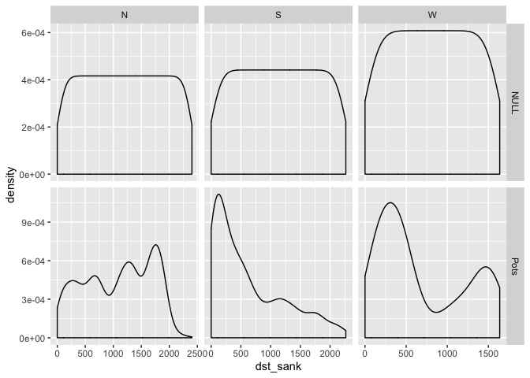

BIOL4408 Marine Ecology: lobster pots 1.
================
TimLanglois
09/01/2020

# 2\. Create Null lobster pot data

Need to install a missing library

``` r
# install.packages("sm")
```

Load some librarys

``` r
library(tidyr)
library(plyr)
library(dplyr)
library(ggplot2)
library(readr) #to write data
library(here) #to make robust links to files
# And you will need these libraries
library(ggmap)
library(sm)
library(KernSmooth)
```

It is useful to set a study name

``` r
study<-"lobster.pots"
```

We are going to use the here() function, which creates a shortcut to
your location.

Check what the here() function returns in your environment? and adapt to
suit

Again - we have to use here::here() - due to conflict with
    plyr::here()

``` r
here::here()
```

    ## [1] "/Users/00068010/GitHub/UWA-BIOL4408-Marine-Ecology/Analysis-lobster-pots"

If you are using an ecocloud server - you will probrably have to add
folder names to the here() function

\#here::here(“workspace”,“Template-lobster-pots”,“Data”)

Let’s make a shortcut to that “Data” directory.

``` r
data.dir <- here::here("Data")

#or for ecocloud

#data.dir <- here::here("workspace","Template-lobster-pots","Data")
```

Let’s make a plots directory and then shortcut to that directory.

``` r
dir.create(file.path(here::here(), "Plots")) #create Data folder

plot.dir <- here::here("Plots")

#or for ecocloud
#dir.create(file.path(here(), "workspace","Template-lobster-pots","Plots")) #create Data folder

#data.dir <- here("workspace","Template-lobster-pots","Plots")
```

Read in pot data

``` r
setwd(data.dir)
dat<-read_csv("lobster.pots.2019-01-23.csv")%>%
  glimpse()
```

    ## Parsed with column specification:
    ## cols(
    ##   .default = col_double(),
    ##   zone = col_character(),
    ##   optional = col_logical(),
    ##   ID_1 = col_logical(),
    ##   Pots = col_logical(),
    ##   FID_ = col_logical(),
    ##   POINT_X = col_logical(),
    ##   POINT_Y = col_logical(),
    ##   id = col_logical()
    ## )

    ## See spec(...) for full column specifications.

    ## Observations: 4,733
    ## Variables: 21
    ## $ Id         <dbl> 0, 0, 0, 0, 0, 0, 0, 0, 0, 0, 0, 0, 0, 0, 0, 0, 0, 0, 0, 0…
    ## $ dst_jettie <dbl> 1037.480, 1055.220, 1030.640, 1017.270, 1024.540, 1060.450…
    ## $ dst_moorin <dbl> 731.598, 744.918, 719.925, 710.491, 722.801, 758.564, 760.…
    ## $ dst_cst    <dbl> 112.7830, 99.9800, 87.3038, 103.0570, 128.1340, 140.7730, …
    ## $ dst_sank   <dbl> 55.8905, 29.1489, 40.3032, 62.6373, 77.6053, 58.2979, 38.0…
    ## $ depth      <dbl> -6.20759, -7.55527, -4.00778, -5.68582, -4.77470, -3.21988…
    ## $ zone       <chr> "N", "N", "N", "N", "N", "N", "N", "N", "N", "N", "N", "N"…
    ## $ X          <dbl> 359662.6, 359638.9, 359657.9, 359674.8, 359681.2, 359652.0…
    ## $ Y          <dbl> 6460112, 6460102, 6460088, 6460096, 6460124, 6460144, 6460…
    ## $ coords.x1  <dbl> 359662.6, 359638.9, 359657.9, 359674.8, 359681.2, 359652.0…
    ## $ coords.x2  <dbl> 6460112, 6460102, 6460088, 6460096, 6460124, 6460144, 6460…
    ## $ optional   <lgl> TRUE, TRUE, TRUE, TRUE, TRUE, TRUE, TRUE, TRUE, TRUE, TRUE…
    ## $ year       <dbl> 2014, 2014, 2014, 2014, 2014, 2014, 2014, 2014, 2014, 2014…
    ## $ ID_1       <lgl> NA, NA, NA, NA, NA, NA, NA, NA, NA, NA, NA, NA, NA, NA, NA…
    ## $ Pots       <lgl> NA, NA, NA, NA, NA, NA, NA, NA, NA, NA, NA, NA, NA, NA, NA…
    ## $ FID_       <lgl> NA, NA, NA, NA, NA, NA, NA, NA, NA, NA, NA, NA, NA, NA, NA…
    ## $ POINT_X    <lgl> NA, NA, NA, NA, NA, NA, NA, NA, NA, NA, NA, NA, NA, NA, NA…
    ## $ POINT_Y    <lgl> NA, NA, NA, NA, NA, NA, NA, NA, NA, NA, NA, NA, NA, NA, NA…
    ## $ id         <lgl> NA, NA, NA, NA, NA, NA, NA, NA, NA, NA, NA, NA, NA, NA, NA…
    ## $ lat        <dbl> -31.98636, -31.98645, -31.98658, -31.98651, -31.98626, -31…
    ## $ lon        <dbl> 115.5145, 115.5143, 115.5145, 115.5147, 115.5147, 115.5144…

\`

# Create Null using other data model for tests

``` r
dat.pots<-dat%>%
  dplyr::select(dst_sank,zone,lat,lon,year)%>%
  mutate(Model="Pots")%>%
  glimpse()
```

    ## Observations: 4,733
    ## Variables: 6
    ## $ dst_sank <dbl> 55.8905, 29.1489, 40.3032, 62.6373, 77.6053, 58.2979, 38.071…
    ## $ zone     <chr> "N", "N", "N", "N", "N", "N", "N", "N", "N", "N", "N", "N", …
    ## $ lat      <dbl> -31.98636, -31.98645, -31.98658, -31.98651, -31.98626, -31.9…
    ## $ lon      <dbl> 115.5145, 115.5143, 115.5145, 115.5147, 115.5147, 115.5144, …
    ## $ year     <dbl> 2014, 2014, 2014, 2014, 2014, 2014, 2014, 2014, 2014, 2014, …
    ## $ Model    <chr> "Pots", "Pots", "Pots", "Pots", "Pots", "Pots", "Pots", "Pot…

``` r
summary1<-plyr::ddply(dat,.(zone), summarise,
                Max = max(dst_sank),
                Min = min(dst_sank),
                Count = length(dst_sank))%>%
  glimpse()
```

    ## Observations: 3
    ## Variables: 4
    ## $ zone  <chr> "N", "S", "W"
    ## $ Max   <dbl> 2403.40, 2264.77, 1637.92
    ## $ Min   <dbl> 0, 0, 0
    ## $ Count <int> 3568, 970, 195

``` r
# Make Null datasets----
# Group1
N = data.frame(dst_sank=seq(0,2403.4, length=3568),
                zone="N",
                Model="NULL")

S = data.frame(dst_sank=seq(0,2264.77, length=970),
                   zone="S",
                Model="NULL")

W = data.frame(dst_sank=seq(0,1637.92, length=195),
                      zone="W",
                Model="NULL")
```

# Combine observed and null datasets for other data

this will create NA for lat,long,year

``` r
dat.model<- dat.pots%>%
  bind_rows(N,S,W)%>%
  glimpse()
```

    ## Warning in bind_rows_(x, .id): binding character and factor vector, coercing
    ## into character vector
    
    ## Warning in bind_rows_(x, .id): binding character and factor vector, coercing
    ## into character vector
    
    ## Warning in bind_rows_(x, .id): binding character and factor vector, coercing
    ## into character vector
    
    ## Warning in bind_rows_(x, .id): binding character and factor vector, coercing
    ## into character vector
    
    ## Warning in bind_rows_(x, .id): binding character and factor vector, coercing
    ## into character vector
    
    ## Warning in bind_rows_(x, .id): binding character and factor vector, coercing
    ## into character vector

    ## Observations: 9,466
    ## Variables: 6
    ## $ dst_sank <dbl> 55.8905, 29.1489, 40.3032, 62.6373, 77.6053, 58.2979, 38.071…
    ## $ zone     <chr> "N", "N", "N", "N", "N", "N", "N", "N", "N", "N", "N", "N", …
    ## $ lat      <dbl> -31.98636, -31.98645, -31.98658, -31.98651, -31.98626, -31.9…
    ## $ lon      <dbl> 115.5145, 115.5143, 115.5145, 115.5147, 115.5147, 115.5144, …
    ## $ year     <dbl> 2014, 2014, 2014, 2014, 2014, 2014, 2014, 2014, 2014, 2014, …
    ## $ Model    <chr> "Pots", "Pots", "Pots", "Pots", "Pots", "Pots", "Pots", "Pot…

# View Null models

Take note that this Null model assumes we have equal probrabilty of
finding lobster (and pots) with increasing distance from the sanctuaries

## Plot the observed and null

``` r
ggplot(dat.model, aes(x=dst_sank))+
  geom_density(alpha=.5)+
  #   geom_histogram(aes(y=..density..))+
  #   facet_wrap( ~ Nearest.Sanctuary,scales = "free",ncol = 2)
  facet_grid( Model~ zone,scales = "free")
```

<!-- -->

Save the data

``` r
setwd(data.dir)

write_csv(dat.model,"dat.model.csv")
```

Go back to
[Analysis-lobster-pots](https://github.com/UWA-BIOL4408-Marine-Ecology/Analysis-lobster-pots/blob/master/README.md)

Go forward to
[2\_lobster-pot-model](https://github.com/UWA-BIOL4408-Marine-Ecology/Analysis-lobster-density/blob/master/2_lobster-density_check-data.md)
