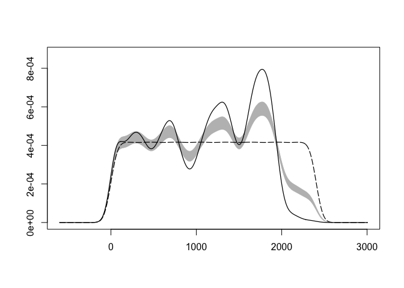
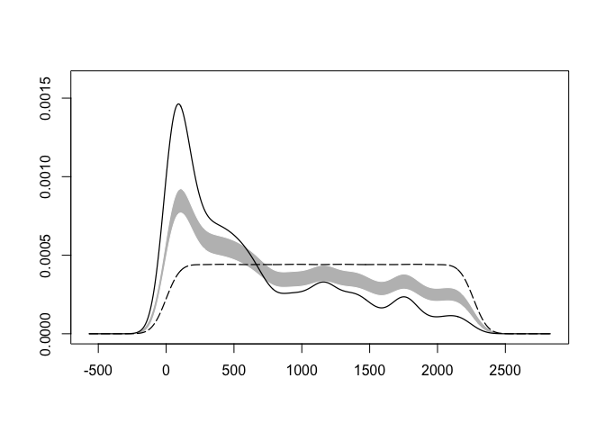
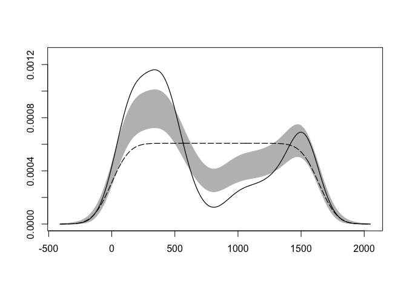

BIOL4408 Marine Ecology: lobster pots 1.
================
TimLanglois
09/01/2020

# 3\. Test lobster pot data

1.  Test null against observed

Need to install a missing library

``` r
# install.packages("sm")
```

Load some librarys

``` r
library(tidyr)
library(plyr)
library(dplyr)
library(ggplot2)
library(readr) #to write data
library(here) #to make robust links to files
# And you will need these libraries
library(ggmap)
library(sm)
library(KernSmooth)
```

Source function \# See Langlois et al. 2012 PLoS ONE for details and
information on the method \# To test for each Sanctuary by changing the
subset

``` r
source("1_Load function KDE.R")
```

It is useful to set a study name

``` r
study<-"lobster.pots"
```

Again - we have to use here::here() - due to conflict with
    plyr::here()

``` r
here::here()
```

    ## [1] "/Users/00068010/GitHub/UWA-BIOL4408-Marine-Ecology/Analysis-lobster-pots"

If you are using an ecocloud server - you will probrably have to add
folder names to the here() function

\#here::here(“workspace”,“Template-lobster-pots”,“Data”)

Let’s make a shortcut to that “Data” directory.

``` r
data.dir <- here::here("Data")

#or for ecocloud

#data.dir <- here::here("workspace","Template-lobster-pots","Data")
```

Let’s make a plots directory and then shortcut to that directory.

``` r
dir.create(file.path(here::here(), "Plots")) #create Data folder

plot.dir <- here::here("Plots")

#or for ecocloud
#dir.create(file.path(here(), "workspace","Template-lobster-pots","Plots")) #create Data folder

#data.dir <- here("workspace","Template-lobster-pots","Plots")
```

Read in pot model data and rename to match fields required by function

``` r
setwd(data.dir)
dat.model<-read_csv("dat.model.csv")%>%
   dplyr::select("dst_sank","zone","Model")%>%
  dplyr::rename(distance = dst_sank,
                location = zone)%>%
  glimpse()
```

    ## Parsed with column specification:
    ## cols(
    ##   dst_sank = col_double(),
    ##   zone = col_character(),
    ##   lat = col_double(),
    ##   lon = col_double(),
    ##   year = col_double(),
    ##   Model = col_character()
    ## )

    ## Observations: 9,466
    ## Variables: 3
    ## $ distance <dbl> 55.8905, 29.1489, 40.3032, 62.6373, 77.6053, 58.2979, 38.071…
    ## $ location <chr> "N", "N", "N", "N", "N", "N", "N", "N", "N", "N", "N", "N", …
    ## $ Model    <chr> "Pots", "Pots", "Pots", "Pots", "Pots", "Pots", "Pots", "Pot…

Run the KDE tests \# KDE test—- \#Test of distribution - this will
generate a P value and a plot \# See Langlois et al. 2012 PLoS ONE for
details and information on the method \# To test for each zone by
changing the subset

North

``` r
WF(filter(dat.model,location=="N"),50,'Model')
```

    ## 
    ## Test of equal densities:  p-value =  0

<!-- -->

South

``` r
WF(filter(dat.model,location=="S"),50,'Model')
```

    ## 
    ## Test of equal densities:  p-value =  0

<!-- -->

West

``` r
WF(filter(dat.model,location=="W"),50,'Model')
```

    ## 
    ## Test of equal densities:  p-value =  0

<!-- -->

[Analysis-lobster-pots](https://github.com/UWA-BIOL4408-Marine-Ecology/Analysis-lobster-pots/blob/master/README.md)
